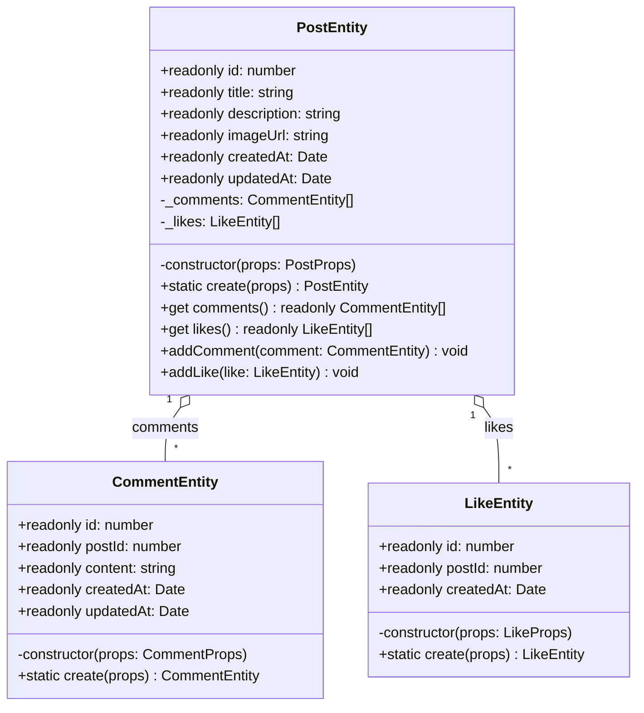
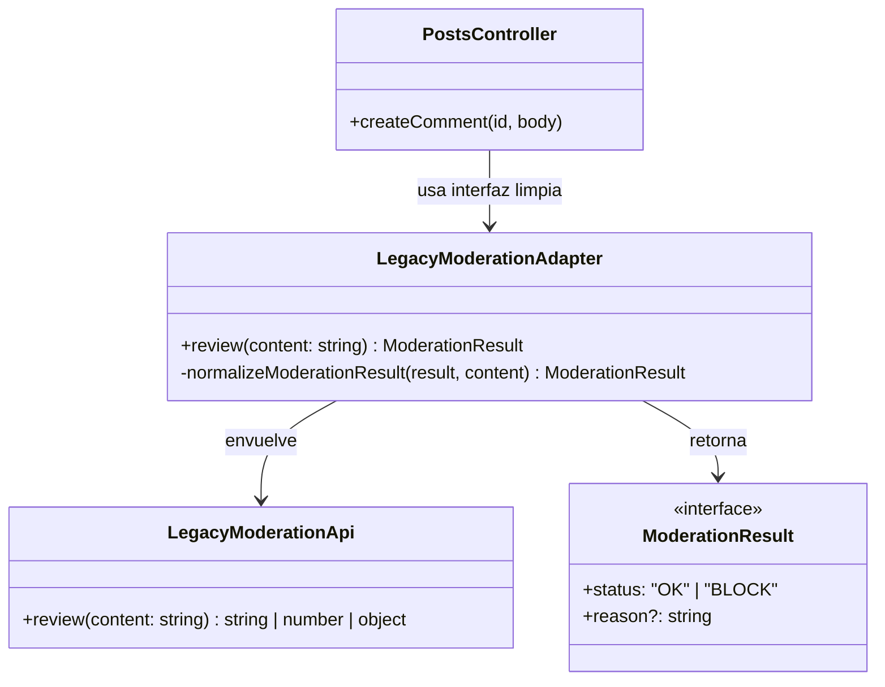
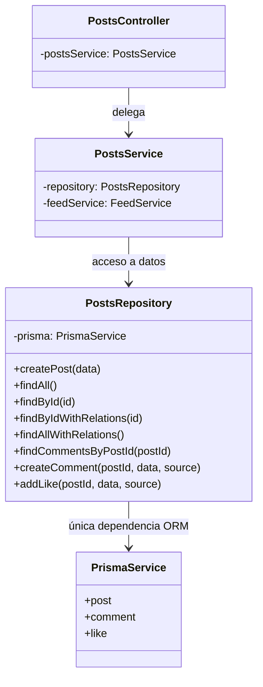
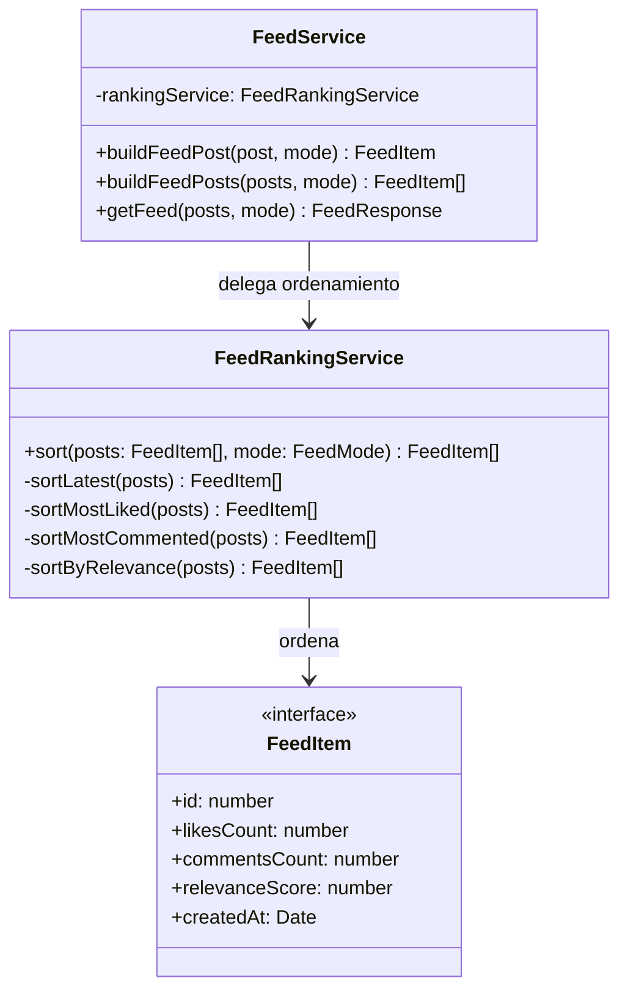
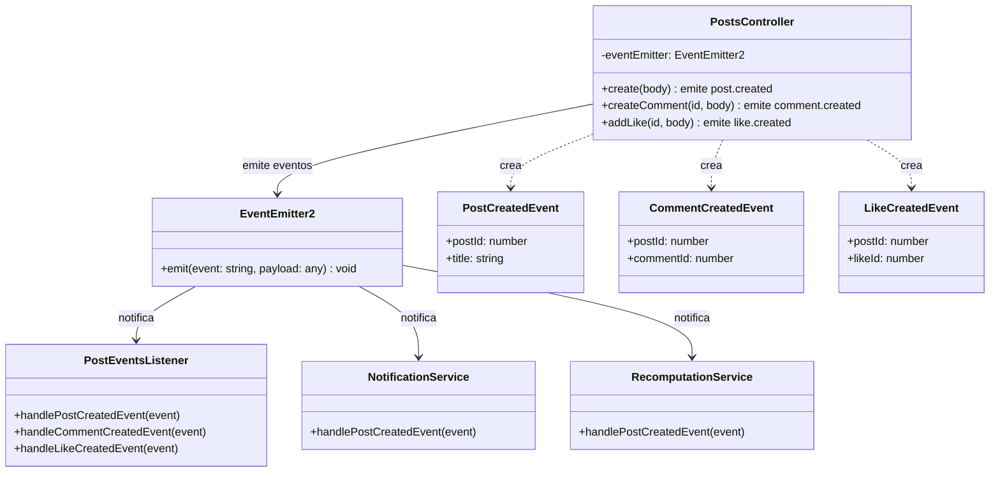
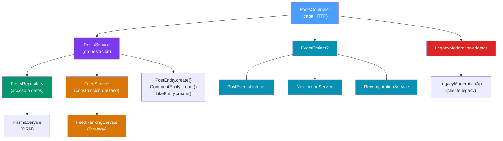

# Patrones de Diseño Aplicados

## Resumen

El código original presentaba múltiples falencias arquitectónicas: un controlador monolítico con más de 326 líneas, acoplamiento directo con la capa de persistencia, lógica procedural secuencial sin separación de responsabilidades, y un cliente legacy de moderación con una interfaz frágil de tipos mixtos.

Se aplicaron **5 patrones de diseño** de los 3 tipos (creacional, estructural, comportamental) para resolver estos problemas.

---

## Patrones Creacionales

### 1. Factory Method

**Problema identificado:** Las entidades de dominio (`PostEntity`, `CommentEntity`, `LikeEntity`) se instanciaban directamente con constructores públicos de hasta 14 parámetros posicionales, sin validación de invariantes. Cualquier parte del código podía crear entidades en estados inválidos.

**Código antes:**
```typescript
// Constructor público con 14 parámetros posicionales
const post = new PostEntity(
    post.id,
    post.title,
    post.description,
    post.imageUrl,
    post.createdAt,
    post.updatedAt,
    likesCount,
    commentsCount,
    relevanceScore,
    relevanceScore > 20,
    "feed-controller",
    tags,
    metadata,
    mode,
)
```

**Solución:** Se implementó el patrón **Factory Method** con constructores privados y métodos estáticos `create()` que validan invariantes de dominio antes de crear la instancia.

**Código después:**
```typescript
export class PostEntity {
    // Constructor privado: nadie puede instanciar directamente
    private constructor(props: PostProps) {
        this.id = props.id
        this.title = props.title
        // ...
    }

    // Factory Method con validación de invariantes
    static create(props: {
        id: number
        title: string
        description: string
        imageUrl: string
        // ...
    }) {
        if (props.title.length < 3 || props.title.length > 120) {
            throw new Error("Title length must be between 3 and 120")
        }
        if (!props.imageUrl.startsWith("http")) {
            throw new Error("Image URL must start with http")
        }
        return new PostEntity({ ...props })
    }
}
```

**Archivos involucrados:**
- `src/posts/entities/post.entity.ts`
- `src/posts/entities/comment.entity.ts`
- `src/posts/entities/like.entity.ts`

**Diagrama de clases:**



---

## Patrones Estructurales

### 2. Adapter

**Problema identificado:** El cliente legacy de moderación (`legacyModerationApi.review()`) devolvía tipos mixtos e impredecibles: `string ("BLOCK" | "OK")`, `number`, u `object ({ pass: boolean })`. El controlador original contenía un bloque `if/else if` extenso para interpretar cada tipo de respuesta, duplicado en cada lugar donde se usaba la moderación.

**Código antes:**
```typescript
// En el controlador: interpretación manual de tipos mixtos
const moderation = legacyModerationApi.review(body.content)
let blocked = false

if (moderation === "BLOCK") {
    blocked = true
} else if (typeof moderation === "number") {
    blocked = moderation < 1
} else if (typeof moderation === "object") {
    blocked = !("pass" in moderation && moderation.pass)
} else if (moderation === "OK") {
    blocked = false
}
```

**Solución:** Se implementó el patrón **Adapter** que envuelve el cliente legacy y normaliza todas las respuestas heterogéneas a una interfaz uniforme `ModerationResult { status: "OK" | "BLOCK", reason?: string }`.

**Código después:**
```typescript
// Interfaz uniforme
export interface ModerationResult {
    status: "OK" | "BLOCK"
    reason?: string
}

// Adapter que normaliza la respuesta del cliente legacy
export const legacyModerationAdapter = {
    review(content: string): ModerationResult {
        const result = legacyModerationApi.review(content)
        return normalizeModerationResult(result, content)
    },
}

// En el controlador: una sola línea limpia
const moderation = legacyModerationAdapter.review(body.content)
if (moderation.status === "BLOCK") {
    throw new BadRequestException(moderation.reason)
}
```

**Archivos involucrados:**
- `src/posts/legacy-moderation.client.ts` (cliente legacy original, sin modificar)
- `src/posts/legacy-moderation.adapter.ts` (adapter nuevo)

**Diagrama de clases:**



### 3. Repository

**Problema identificado:** El controlador inyectaba `PrismaService` directamente y ejecutaba queries de Prisma inline en cada método, mezclando la capa de presentación (HTTP) con la capa de infraestructura (ORM/BD). Había 4 llamadas directas a `this.prisma` en el controlador.

**Código antes:**
```typescript
// En el controlador: acceso directo a Prisma
@Controller("api/posts")
export class PostsController {
    constructor(
        private readonly postsService: PostsService,
        private readonly prisma: PrismaService, // acoplamiento directo
    ) {}

    async getFeed() {
        const posts = await this.prisma.post.findMany({
            include: { comments: true, likes: true },
        })
        // ...
    }
}
```

**Solución:** Se implementó el patrón **Repository** que encapsula todo el acceso a datos en una única clase `PostsRepository`. Solo esta clase conoce Prisma, las demás capas trabajan con abstracciones.

**Código después:**
```typescript
@Injectable()
export class PostsRepository {
    constructor(private readonly prisma: PrismaService) {}

    createPost(data: CreatePostDto) { ... }
    findAll() { ... }
    findById(id: number) { ... }
    findByIdWithRelations(id: number) { ... }
    findAllWithRelations() { ... }
    findCommentsByPostId(postId: number) { ... }
    createComment(postId, data, source) { ... }
    addLike(postId, data, source) { ... }
}

// El servicio ahora depende del repositorio, no de Prisma
@Injectable()
export class PostsService {
    constructor(
        private readonly repository: PostsRepository,  // abstracción
        private readonly feedService: FeedService,
    ) {}
}
```

**Archivos involucrados:**
- `src/posts/posts.repository.ts` (nuevo)
- `src/posts/posts.service.ts` (refactorizado)

**Diagrama de clases:**



---

## Patrones Comportamentales

### 4. Strategy

**Problema identificado:** La lógica de ordenamiento del feed estaba implementada como un bloque `switch` de más de 30 líneas dentro del controlador. Agregar un nuevo modo de ordenamiento requería modificar directamente el controlador, violando el principio Open/Closed.

**Código antes:**
```typescript
// En el controlador: switch de 30+ líneas
switch (mode) {
    case "latest":
        sorted = sorted.sort((a, b) => b.createdAt.getTime() - a.createdAt.getTime())
        break
    case "mostLiked":
        sorted = sorted.sort((a, b) => b.likesCount - a.likesCount)
        break
    case "mostCommented":
        sorted = sorted.sort((a, b) => b.commentsCount - a.commentsCount)
        break
    case "relevance":
        sorted = sorted.sort((a, b) => b.relevanceScore - a.relevanceScore)
        break
    default:
        sorted = sorted.sort((a, b) => b.createdAt.getTime() - a.createdAt.getTime())
        break
}
```

**Solución:** Se implementó el patrón **Strategy** con un mapa de estrategias de ordenamiento en `FeedRankingService`. Cada modo de feed es una función de ordenamiento intercambiable.

**Código después:**
```typescript
export type FeedMode = "latest" | "mostLiked" | "mostCommented" | "relevance"

@Injectable()
export class FeedRankingService {
    sort(posts: FeedItem[], mode: FeedMode): FeedItem[] {
        const strategies: Record<FeedMode, (items: FeedItem[]) => FeedItem[]> = {
            latest: this.sortLatest,
            mostLiked: this.sortMostLiked,
            mostCommented: this.sortMostCommented,
            relevance: this.sortByRelevance,
        }

        const sorter = strategies[mode] || this.sortLatest
        return sorter(posts)
    }

    private sortLatest(posts: FeedItem[]) { ... }
    private sortMostLiked(posts: FeedItem[]) { ... }
    private sortMostCommented(posts: FeedItem[]) { ... }
    private sortByRelevance(posts: FeedItem[]) { ... }
}
```

**Archivos involucrados:**
- `src/posts/feed-ranking.service.ts` (nuevo)
- `src/posts/feed.service.ts` (nuevo, orquesta mapeo + ranking)

**Diagrama de clases:**



### 5. Observer

**Problema identificado:** El controlador ejecutaba efectos secundarios (logging, notificaciones, recomputaciones) de forma secuencial e inline después de cada operación, creando acoplamiento directo entre la lógica de negocio y la infraestructura.

**Código antes:**
```typescript
// En el controlador: efectos secuenciales acoplados
const created = await this.postsService.create(body)

logDomainEvent("post.created", { postId: created.id, title: created.title })
fakeSendNotification("post", { postId: created.id })
fakeRecomputeSomething(created.id)
```

**Solución:** Se implementó el patrón **Observer** usando el sistema de eventos de NestJS (`EventEmitter2` + `@OnEvent`). El controlador emite eventos de dominio y los listeners reaccionan de forma desacoplada.

**Código después:**
```typescript
// Eventos de dominio tipados
export class PostCreatedEvent {
    constructor(
        public readonly postId: number,
        public readonly title: string,
    ) {}
}

// Controlador: emite el evento
this.eventEmitter.emit("post.created", new PostCreatedEvent(created.id, created.title))

// Listeners: reaccionan de forma independiente
@Injectable()
export class PostEventsListener {
    @OnEvent("post.created")
    handlePostCreatedEvent(event: PostCreatedEvent) {
        console.log("[event:post.created]", event)
    }
}

@Injectable()
export class NotificationService {
    @OnEvent("post.created")
    handlePostCreatedEvent(event: PostCreatedEvent) {
        console.log(`[notify:post]`, { postId: event.postId })
    }
}

@Injectable()
export class RecomputationService {
    @OnEvent("post.created")
    handlePostCreatedEvent(event: PostCreatedEvent) {
        console.log(`[recompute] postId=${event.postId}`)
    }
}
```

**Archivos involucrados:**
- `src/events/post-created.event.ts` (nuevo)
- `src/events/comment-created.event.ts` (nuevo)
- `src/events/like-created.event.ts` (nuevo)
- `src/posts/listeners/post-events.listener.ts` (nuevo)
- `src/posts/listeners/notification.service.ts` (nuevo)
- `src/posts/listeners/recomputation.service.ts` (nuevo)

**Diagrama de clases:**



---

## Resumen de patrones por tipo

| Tipo | Patrón | Problema resuelto |
|------|--------|-------------------|
| **Creacional** | Factory Method | Entidades con constructores públicos frágiles y sin validación de invariantes |
| **Estructural** | Adapter | Cliente legacy con interfaz de tipos mixtos e impredecibles |
| **Estructural** | Repository | Acceso directo a Prisma desde el controlador, mezclando capas |
| **Comportamental** | Strategy | Switch de 30+ líneas para ordenamiento del feed, violando Open/Closed |
| **Comportamental** | Observer | Efectos secundarios acoplados secuencialmente en el controlador |

## Arquitectura resultante


